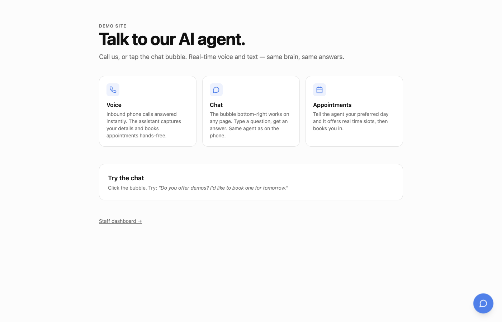
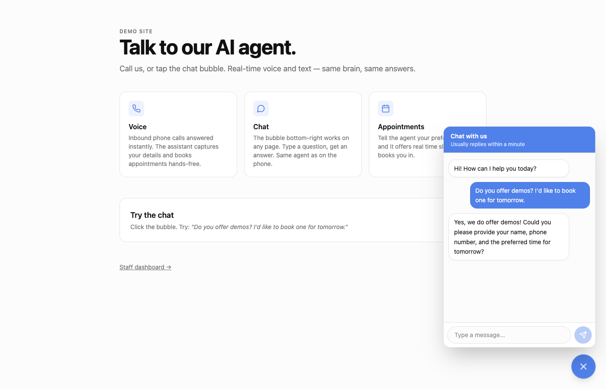
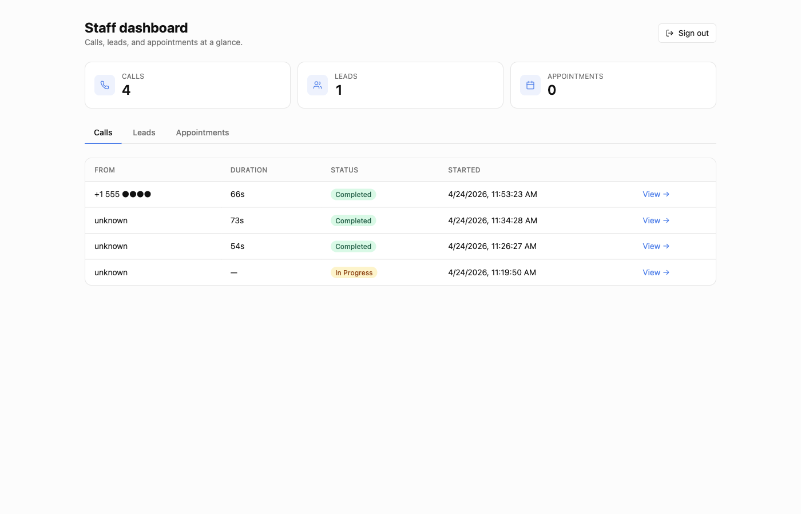
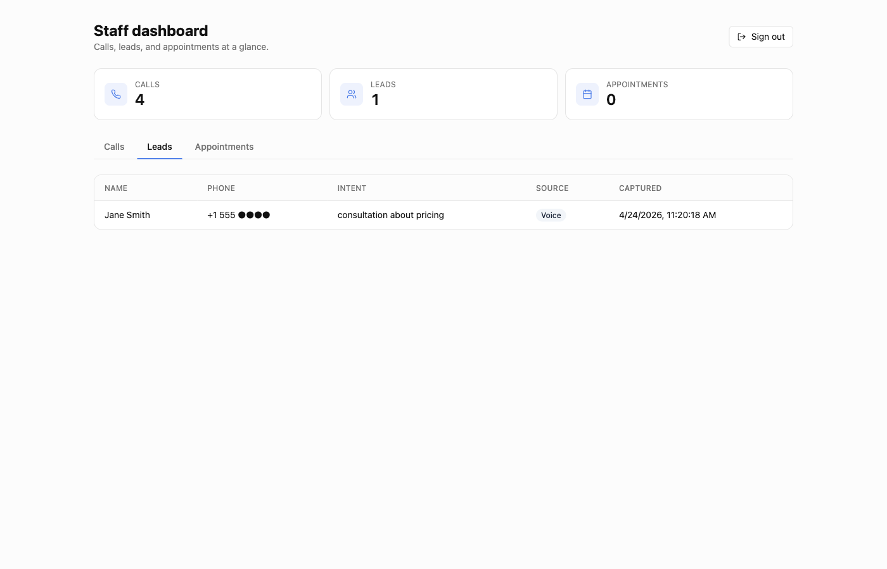
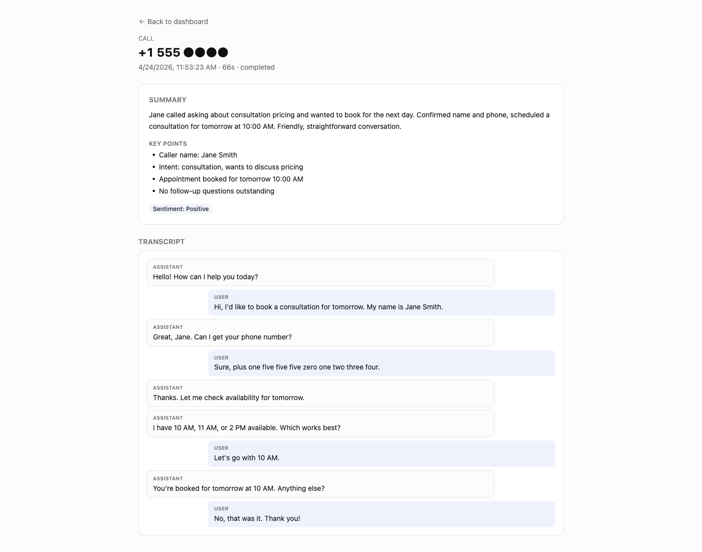

# AI Voice Agent

An AI that answers your phone calls, chats on your website, books appointments, and writes call summaries for you. One brain, three surfaces, all data in Supabase.

Built in a single session using [Vapi](https://vapi.ai), [Twilio](https://twilio.com), [OpenAI](https://openai.com), [Supabase](https://supabase.com), and [Claude Code](https://www.anthropic.com/claude-code).



## What it does

- **📞 Voice** — Inbound phone calls answered by an AI agent. Captures leads (name, phone, intent) and books appointments hands-free.
- **💬 Chat** — A floating chat bubble you can drop into any website. Same LLM brain as voice, same appointment-booking capability.
- **📅 Appointments** — Checks real availability against business hours + existing bookings, then writes to Supabase.
- **📝 Summaries** — Every call gets a post-hoc OpenAI summary with key points, sentiment, and next steps.
- **📊 Dashboard** — Staff-only web UI for reviewing calls, leads, and appointments.

## Screenshots

### Chat bubble

The bubble sits bottom-right of any page. Tap it, ask a question, get a real answer in a second.



### Staff dashboard

Token-gated. Paste your `ADMIN_TOKEN` once and the dashboard remembers you.





### Call detail

Click any call to see the full transcript alongside an AI-generated summary, key points, and sentiment.



## Architecture

```
┌────────┐   ┌──────────┐   ┌──────┐   ┌────────────────────┐   ┌──────────┐
│ Caller │──▶│ Phone #  │──▶│ Vapi │──▶│ This backend       │──▶│ Supabase │
│ (PSTN) │   │ (Vapi or │   │ (AI) │   │ Express + TS       │   │ Postgres │
└────────┘   │  Twilio) │   └──────┘   │                    │   │  + RLS   │
             └──────────┘              │ • webhooks         │   └──────────┘
                                       │ • tool endpoints   │         ▲
┌────────┐   ┌──────────┐               │ • /api/chat        │         │
│ Web    │──▶│ Chat     │──────────────▶│ • /api/admin       │─────────┘
│ visitor│   │ bubble   │               └────────────────────┘
└────────┘   └──────────┘                         │
                                                  ▼
                                           ┌─────────────┐
                                           │ OpenAI      │
                                           │ (chat +     │
                                           │  summaries) │
                                           └─────────────┘
```

**Voice path**: Vapi runs the speech-to-text, LLM, and text-to-speech. Our backend only receives webhooks + exposes "tools" the AI can call mid-conversation (`capture_lead`, `check_availability`, `book_appointment`).

**Chat path**: React widget → `/api/chat/message` → OpenAI → stored in Supabase.

**Dashboard path**: React pages → `/api/admin/*` (Bearer-token protected) → Supabase.

## Stack

| Layer       | Tech                                                                 |
|-------------|----------------------------------------------------------------------|
| Backend     | Node 22 · Express 5 · TypeScript · Zod · Pino                        |
| Database    | Supabase (Postgres + RLS)                                            |
| Voice       | Vapi (Deepgram STT · OpenAI LLM · Vapi TTS) + Twilio/Vapi numbers    |
| LLM (chat)  | OpenAI GPT-4o-mini                                                   |
| Frontend    | React 19 · Vite 6 · Tailwind v4 · react-router-dom · lucide-react    |

## Project structure

```
.
├── src/                      # backend
│   ├── api/
│   │   ├── admin.ts          # /api/admin/* — calls, leads, appointments
│   │   └── chat.ts           # /api/chat/message
│   ├── config/
│   │   └── businessHours.ts  # timezone + open/close hours
│   ├── lib/
│   │   ├── logger.ts         # pino + redaction
│   │   ├── openai.ts         # lazy OpenAI client
│   │   └── verifySignature.ts
│   ├── services/
│   │   ├── appointments.ts   # slot generation + booking
│   │   ├── calls.ts
│   │   ├── leads.ts
│   │   └── summaries.ts
│   ├── tools/                # Vapi-invoked tool endpoints
│   │   ├── bookAppointment.ts
│   │   ├── captureLead.ts
│   │   ├── checkAvailability.ts
│   │   └── router.ts
│   ├── webhooks/
│   │   ├── twilio.ts         # Twilio inbound (optional, SIP path)
│   │   └── vapi.ts           # call events + end-of-call
│   ├── env.ts                # zod-validated env
│   ├── supabase.ts
│   └── index.ts
├── web/                      # frontend (Vite)
│   └── src/
│       ├── components/ChatBubble.tsx
│       ├── pages/
│       │   ├── Home.tsx
│       │   ├── Dashboard.tsx
│       │   └── CallDetail.tsx
│       └── lib/
│           ├── adminApi.ts
│           └── cn.ts
├── scripts/
│   ├── configure-vapi.sh     # push assistant config via Vapi REST API
│   └── check-env.js
├── supabase/
│   └── migrations/
│       ├── 0001_init.sql     # calls, leads, appointments, call_summaries
│       └── 0002_chat.sql     # chat_sessions, chat_messages
├── env.example
└── package.json
```

## Setup

### Prerequisites

- Node 22 (`nvm use`)
- [Supabase](https://supabase.com) project (free tier works)
- [Vapi](https://vapi.ai) account (free tier comes with $10 credit)
- [OpenAI](https://platform.openai.com) key with $5+ balance (powers chat + summaries)
- [ngrok](https://ngrok.com) or equivalent for dev (webhooks need HTTPS)

### 1. Clone + install

```bash
git clone https://github.com/mido324/ai-voice-agent
cd ai-voice-agent
npm install
cd web && npm install && cd ..
cp env.example .env
```

### 2. Supabase

1. Create a project.
2. Open **SQL Editor** → paste the contents of `supabase/migrations/0001_init.sql` → Run.
3. Repeat for `supabase/migrations/0002_chat.sql`.
4. From **Project Settings → API Keys**, copy into `.env`:
   - `SUPABASE_URL` (project URL)
   - `SUPABASE_ANON_KEY` (starts with `sb_publishable_...`)
   - `SUPABASE_SERVICE_ROLE_KEY` (starts with `sb_secret_...` — server-only)

### 3. Vapi

1. Create a new assistant in the [Vapi dashboard](https://dashboard.vapi.ai). Copy the ID.
2. Copy into `.env`:
   - `VAPI_API_KEY` (Private key)
   - `VAPI_ASSISTANT_ID`
   - `VAPI_WEBHOOK_SECRET=<any random 32+ char string, `openssl rand -hex 24`>`
3. Under **Phone Numbers** in Vapi, either import a Twilio number or buy a Vapi number. Assign your assistant to it.

### 4. OpenAI + admin token

```bash
# append to .env
echo "OPENAI_API_KEY=sk-..." >> .env
echo "ADMIN_TOKEN=$(openssl rand -hex 32)" >> .env
```

### 5. Expose + configure

```bash
# terminal 1: backend
npm run dev

# terminal 2: public tunnel
ngrok http 3000
# copy the https://....ngrok-free.app URL into .env as PUBLIC_BASE_URL
# (then restart `npm run dev`)

# terminal 3: push assistant config to Vapi (system prompt + tools + server URL)
bash scripts/configure-vapi.sh

# terminal 4: frontend
cd web && npm run dev
```

### 6. Use it

- **Voice**: call your phone number → AI answers
- **Chat**: http://localhost:5173 → click the bubble
- **Dashboard**: http://localhost:5173/dashboard → paste your `ADMIN_TOKEN`

## Environment variables

| Var                         | Required | Notes                                              |
|-----------------------------|----------|----------------------------------------------------|
| `SUPABASE_URL`              | ✅       | Project URL                                        |
| `SUPABASE_SERVICE_ROLE_KEY` | ✅       | Server-only, bypasses RLS                          |
| `SUPABASE_ANON_KEY`         | ✅       | Public key (safe to expose to browser)             |
| `VAPI_API_KEY`              | ✅       | Private key from Vapi dashboard                    |
| `VAPI_ASSISTANT_ID`         | ✅       | The assistant configured by `configure-vapi.sh`    |
| `VAPI_WEBHOOK_SECRET`       | ✅       | Random string, verified on every Vapi webhook      |
| `PUBLIC_BASE_URL`           | ✅       | Public HTTPS URL the assistant calls back on       |
| `OPENAI_API_KEY`            | optional | Required for chat widget + call summaries          |
| `ADMIN_TOKEN`               | optional | Required for the `/dashboard`                      |
| `TWILIO_*`                  | optional | Only if using the SIP-forwarding path              |
| `VAPI_PHONE_SIP`            | optional | Only if using the SIP-forwarding path              |

## Scripts

| Command                              | What it does                                |
|--------------------------------------|---------------------------------------------|
| `npm run dev`                        | Backend with hot reload                     |
| `npm run build`                      | Compile backend TS → `dist/`                |
| `npm start`                          | Run compiled backend                        |
| `npm run typecheck`                  | `tsc --noEmit`                              |
| `cd web && npm run dev`              | Frontend on :5173                           |
| `cd web && npm run build`            | Production frontend bundle                  |
| `bash scripts/configure-vapi.sh`     | Push assistant config (prompt + tools) to Vapi |

## Business hours

Edit `src/config/businessHours.ts` to change timezone, slot length, days, or services. The assistant will respect these when offering slots.

## Privacy & security notes

- The service-role Supabase key bypasses RLS. Keep `.env` out of git (`.gitignore` excludes it).
- Signature verification is enforced on both Vapi and Twilio webhook paths.
- Phone numbers are redacted in pino logs.
- Row-level security is enabled on every table; only the server (with service-role) can write.

## Roadmap (not implemented)

- Human agent handoff (transfer to a live person mid-call)
- WhatsApp as a third channel
- Bilingual Arabic + English (voice already supports it; UI would need i18next)
- Deploy target (Railway backend + Vercel frontend)

## License

MIT — do what you want with it.
